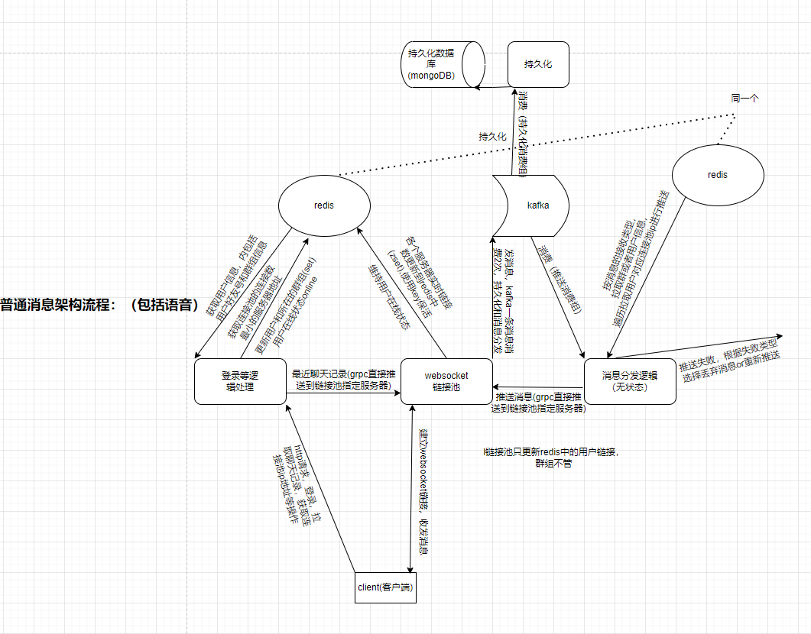
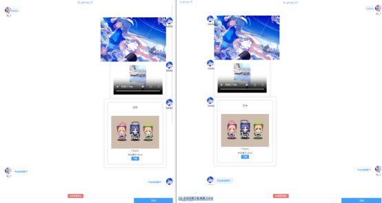
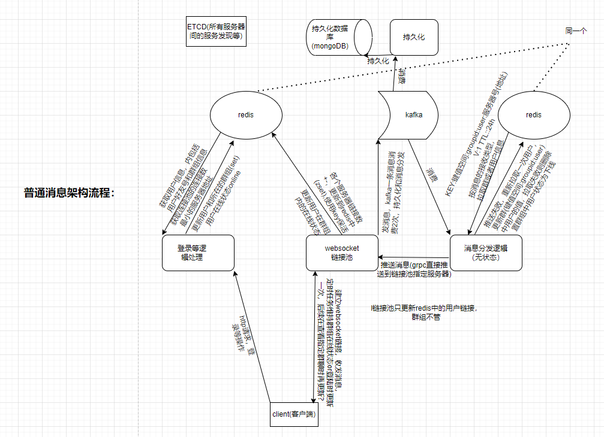
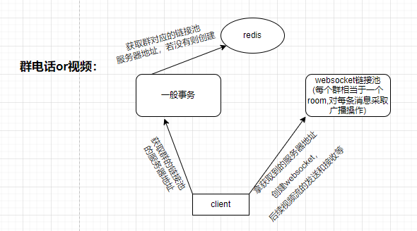

# lalala_im
# 简单的im系统

## 前端：
https://github.com/XlalalaX/la_vue

## 流程图

## 效果图

## 另一版可能但是没实现的流程图

控制用户在群组的在线状态有点麻烦，还有用户在登陆状态下群组在线状态被置为下线后中间为接收到的消息的同步等也挺麻烦就没搞这版。

## 本来想实现的功能，但是没实现

群电话虽然已经用上面的通讯系统实现了，但是视频实在不适合用上边的系统去搞。但是前端视频通话组件实在不会搞，就没搞了。